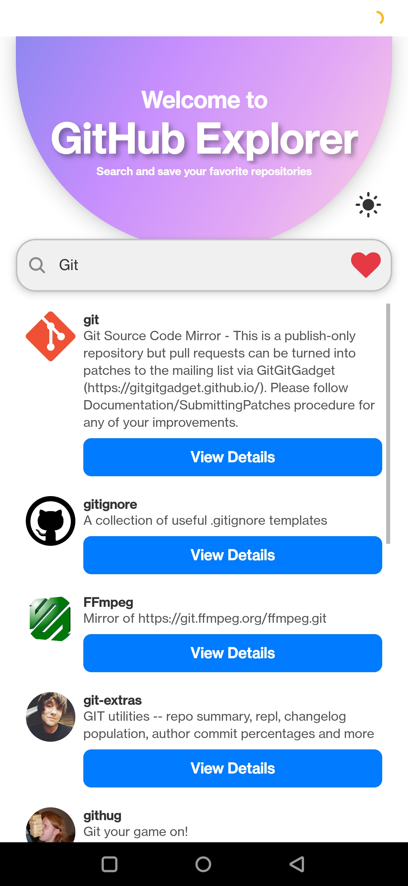
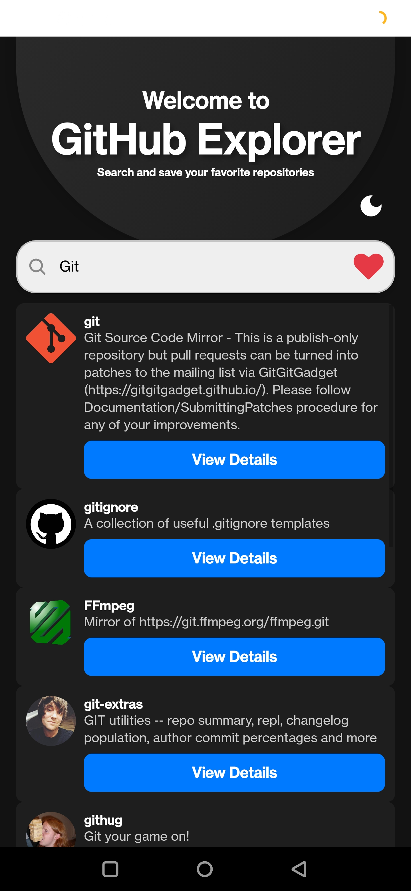
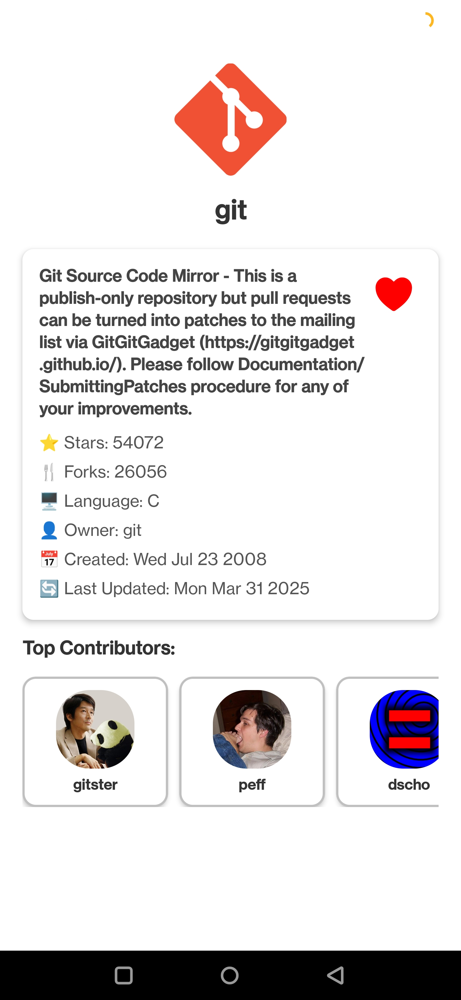
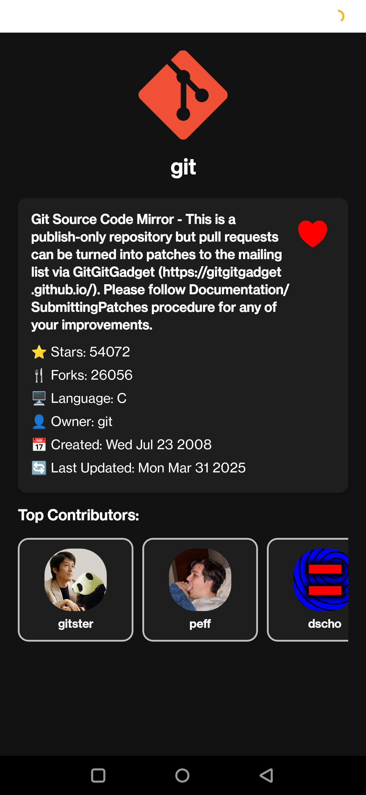
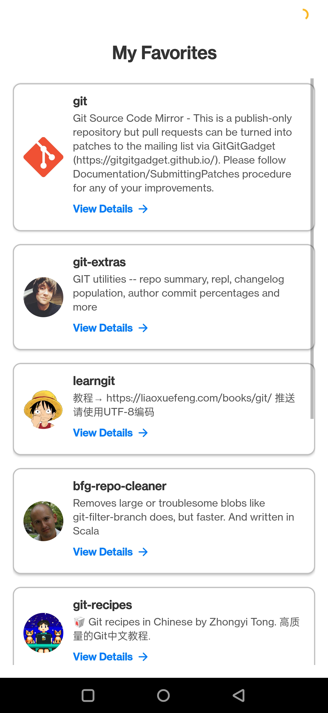
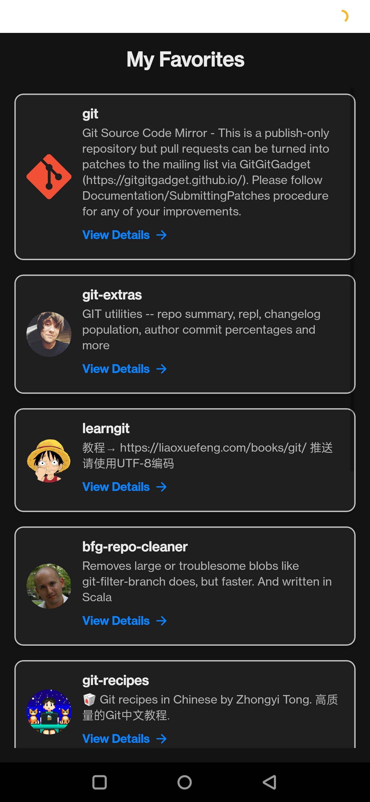

# GitHub Repository Explorer 📂

## Overview

GitHub Repository Explorer is a **React Native** application that allows users to **search** for GitHub repositories, **view repository details**, and **mark repositories as favorites**. It provides an intuitive and responsive UI with **dark mode support** for better accessibility.

## Features ✨

- 🔍 **Search Repositories**: Quickly find GitHub repositories by entering a search query.
- 📑 **View Repository Details**: Get detailed information such as stars, forks, primary language, owner details, and creation date.
- ❤️ **Favorite Repositories**: Add or remove repositories from your favorites list for easy access.
- 🌗 **Dark Mode Support**: Toggle between light and dark themes seamlessly.
- 🎨 **Beautiful UI**: Smooth gradients, vector icons, and a well-structured interface.
- 🚀 **Infinite Scrolling**: Load more repositories as you scroll down the list.
- 🔄 **React Navigation**: Seamless navigation between screens for an enhanced user experience.
- ⚡ **Optimized Performance**: Efficient API calls with pagination to reduce unnecessary loads.
- ⚙ **Error Handling**: Alerts and messages for API errors and network issues.

## Tech Stack 🛠

- **Frontend**: React Native (Expo)
- **State Management**: Context API (or Redux, if applicable)
- **Navigation**: React Navigation
- **Networking**: Axios for API calls
- **API**: GitHub REST API
- **UI Components**: `expo-linear-gradient`, `@react-native-masked-view/masked-view`, `@expo/vector-icons`

## Installation 🚀

1. Clone the repository:
   ```sh
   git clone https://github.com/Asaimohan/RepositorySearch.git
   cd repository-explorer
   ```
2. Install dependencies:
   ```sh
   npm install
   ```
3. Start the development server:
   ```sh
   npx expo start
   ```

## Usage 📱

1. Open the app on your **emulator** or **physical device**.
2. Use the **search bar** to find GitHub repositories by name.
3. Tap on a repository to view its **detailed information**.
4. Click on the **heart icon** to add or remove repositories from your **favorites list**.
5. Press the **Sun/Moon** icon to toggle between **Light Mode** and **Dark Mode**.
6. Scroll down to load more repositories (**pagination enabled**).

## Screenshots 📸


| Light Mode |  Dark Mode |
|--------------|------------------|
|  |  |
|--------------|------------------|
|  |  |
|--------------|------------------|
|  |  |


Happy Coding! 🚀🎉

